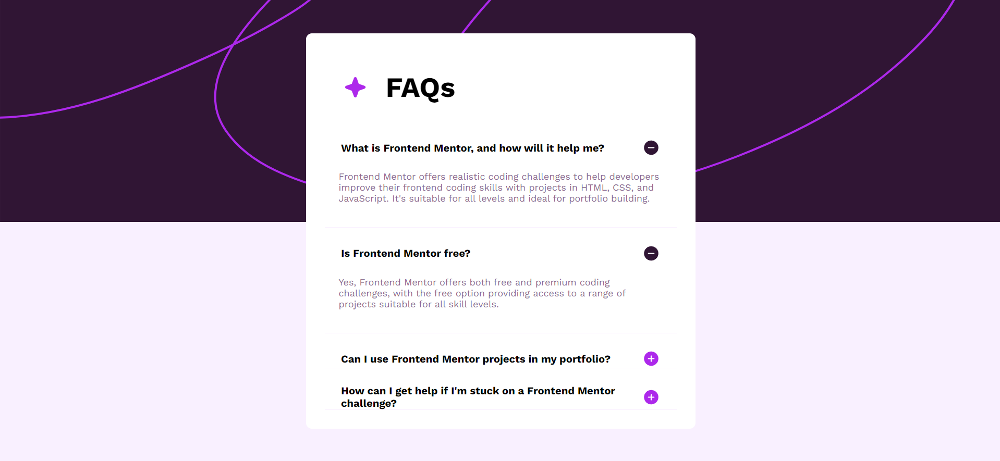
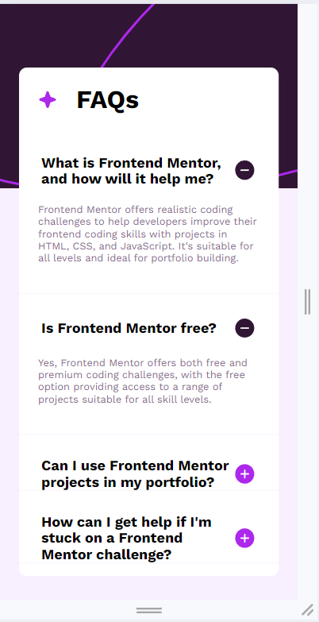

# Frontend Mentor - FAQ accordion solution

This is a solution to the [FAQ accordion challenge on Frontend Mentor](https://www.frontendmentor.io/challenges/faq-accordion-wyfFdeBwBz). Frontend Mentor challenges help you improve your coding skills by building realistic projects. 

## Table of contents

- [Overview](#overview)
  - [The challenge](#the-challenge)
  - [Screenshot](#screenshot)
  - [Links](#links)
- [My process](#my-process)
  - [Built with](#built-with)
  - [What I learned](#what-i-learned)
- [Author](#author)

**Note: Delete this note and update the table of contents based on what sections you keep.**

## Overview

### The challenge

Users should be able to:

- Hide/Show the answer to a question when the question is clicked
- Navigate the questions and hide/show answers using keyboard navigation alone
- View the optimal layout for the interface depending on their device's screen size
- See hover and focus states for all interactive elements on the page

### Screenshot

- Resolution => 1920 x 1080px

### Links

- Solution URL: - Solution URL : [GitHub]()

## My process

Have applied the mobile-first approach. All scripting is in HTML, CSS and Vanilla JS. The most challenging section was the JS section.

### Built with

- Semantic HTML5 markup
- CSS custom properties
- Vanilla JS
- Mobile-first workflow

### What I learned

1. Adding EventListeners
2. QuerySelector
3. QuerySelectorAll
4. NodeLists

## Author

- GitHub - [Taizun Jafri](https://github.com/taizun-jj202)
- Frontend Mentor - [@taizun-jj202](https://www.frontendmentor.io/profile/taizun-jj202)
- Twitter - [@JafriTaizun](https://www.twitter.com/JafriTaizun)

