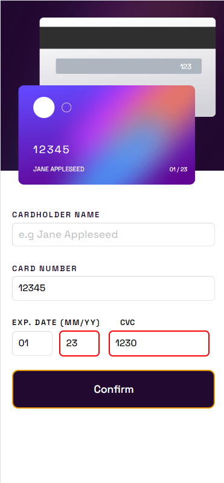

# Frontend Mentor - Interactive card details form solution

This is a solution to the [Interactive card details form challenge on Frontend Mentor](https://www.frontendmentor.io/challenges/interactive-card-details-form-XpS8cKZDWw). Frontend Mentor challenges help you improve your coding skills by building realistic projects. 

## Table of contents

- [Overview](#overview)
  - [The challenge](#the-challenge)
  - [Screenshot](#screenshots)
  - [Links](#links)
- [Built with](#built-with)
- [Author](#author)

**Note: Delete this note and update the table of contents based on what sections you keep.**

## Overview

### The challenge

Users should be able to:

- Fill in the form and see the card details update in real-time
- Receive error messages when the form is submitted if:
  - Any input field is empty
  - The card number, expiry date, or CVC fields are in the wrong format
- View the optimal layout depending on their device's screen size
- See hover, active, and focus states for interactive elements on the page

### Screenshots

---
| Mobile View | Mobile View with Error |
| ------------| -----------------------| 
|| |

### Links

- Solution URL: [GitHub](https://github.com/taizun-jj202/frontendmentor.io/tree/main/interactive-card-details-form-main)
- Live Site URL: [GitHub Pages](https://taizun-jj202.github.io/frontendmentor.io/interactive-card-details-form-main/)

### Built with

- Semantic HTML5 markup
- CSS custom properties
- Flexbox
- Mobile-first workflow
- Absolute Positioning 
- Relative Positioning

**Note: These are just examples. Delete this note and replace the list above with your own choices**

## Author

- GitHub - [Taizun Jafri](https://github.com/taizun-jj202)
- Frontend Mentor - [@taizun-jj202](https://www.frontendmentor.io/profile/taizun-jj202)
- Twitter - [@JafriTaizun](https://www.twitter.com/JafriTaizun)

