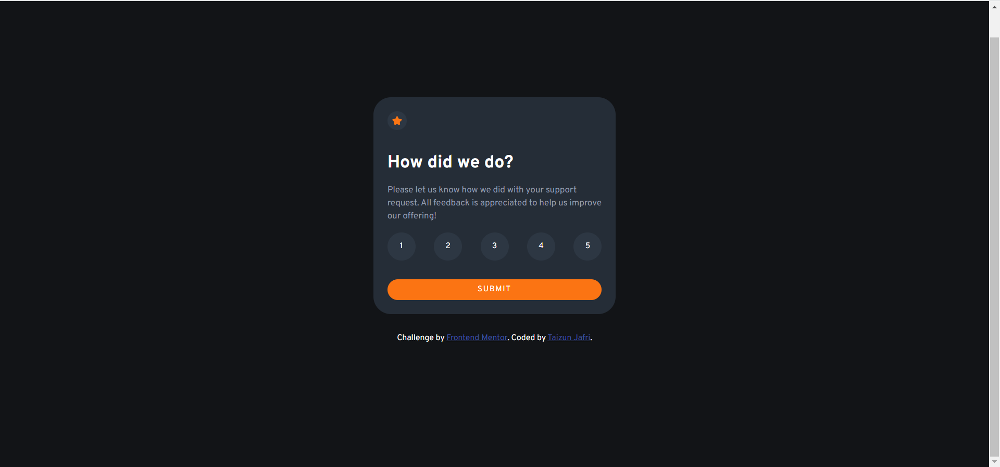
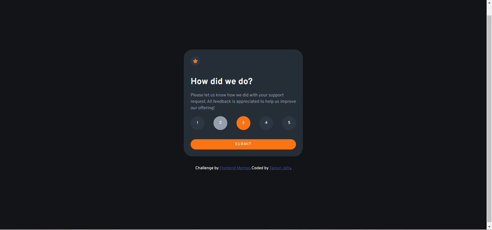
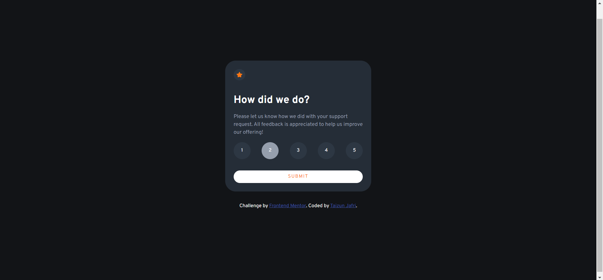
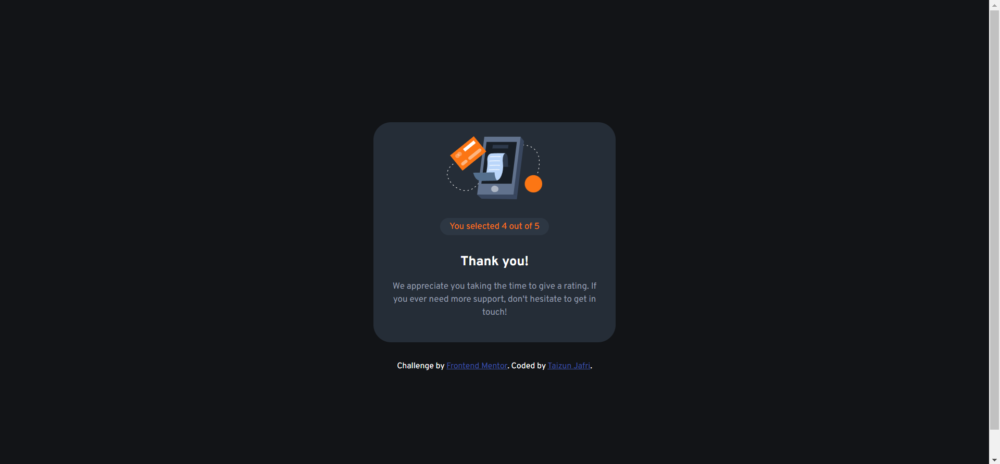

# Frontend Mentor - Interactive rating component solution

This is a solution to the [Interactive rating component challenge on Frontend Mentor](https://www.frontendmentor.io/challenges/interactive-rating-component-koxpeBUmI). Frontend Mentor challenges help you improve your coding skills by building realistic projects. 

## Table of contents

- [Overview](#overview)
  - [The challenge](#the-challenge)
  - [Screenshots](#screenshot)
  - [Links](#links)
- [My process](#my-process)
  - [Built with](#built-with)
  - [What I learned](#what-i-learned)
- [Author](#author)

## Overview

### The challenge

Users should be able to:

- View the optimal layout for the app depending on their device's screen size
- See hover states for all interactive elements on the page
- Select and submit a number rating
- See the "Thank you" card state after submitting a rating

### Screenshots

- This is the default desktop view. 
  - Width => 400px.
  - Height => Auto.

- These view shows the hover effect changes

- This card displays the previously displayed 1 to 5 ratings using JavaScript

### Links

- Solution URL: [GitHub](https://github.com/taizun-jj202/frontendmentor.io/tree/main/interactive-rating-component-main)

## My process

### Built with

- Semantic HTML5 markup
- CSS  properties
- Flexbox
- CSS Grid
- JavaScript
- DOM Manipulation
- EventListeners (JS)

### What I learned

I learned to use JS for DOM manipulation.
Used Event-listeners, click events and DOM.
Am planning more JS projects to improve my skills.

## Author

- GitHub - [Taizun Jafri](https://github.com/taizun-jj202)
- Frontend Mentor - [@taizun-jj202](https://www.frontendmentor.io/profile/taizun-jj202)
- Twitter - [@JafriTaizun](https://www.twitter.com/JafriTaizun)ss