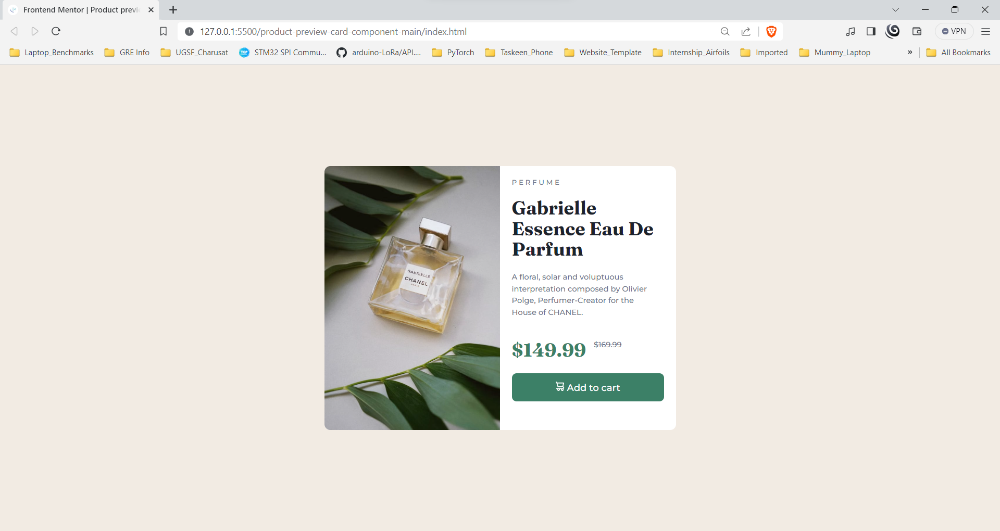
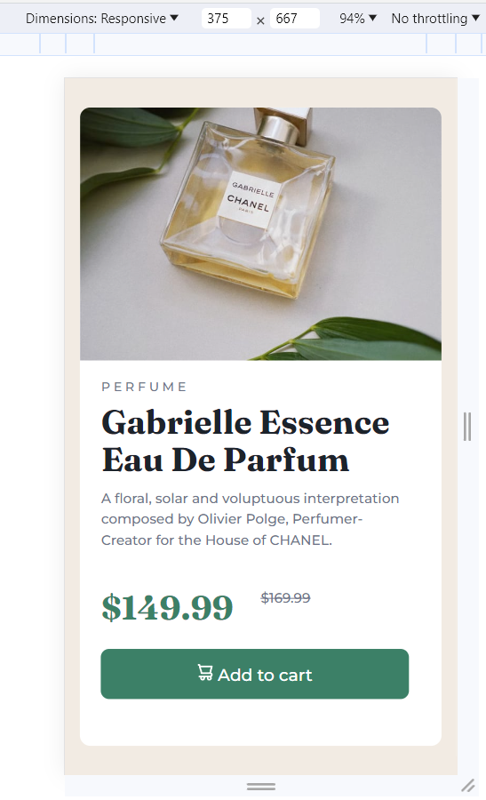

# Frontend Mentor - Product preview card component solution

This is a solution to the [Product preview card component challenge on Frontend Mentor](https://www.frontendmentor.io/challenges/product-preview-card-component-GO7UmttRfa). Frontend Mentor challenges help you improve your coding skills by building realistic projects. 

## Table of contents

- [Overview](#overview)
  - [The challenge](#the-challenge)
  - [Screenshot](#screenshot)
  - [Links](#links)
- [My process](#my-process)
  - [Built with](#built-with)
  - [What I learned](#what-i-learned)
- [Author](#author)

## Overview

### The challenge

Users should be able to:

- View the optimal layout depending on their device's screen size
- See hover and focus states for interactive elements

### Screenshot

- This is the desktop view. 
  - Resolution => 1920 x 897
  - Browser    => Brave 

- The mobile view 
  - Resolution => 375 x 630
  - Browser    => Brave 

### Links

- Solution URL: [GitHub Solution](https://github.com/taizun-jj202/frontendmentor.io/tree/main/product-preview-card-component-main)
- Live Site URL: [Live Frontend Site](https://frontendmentor-io-x7d9.vercel.app/)

## My process

### Built with

- Semantic HTML5 markup
- CSS custom properties
- Flex
- CSS Grid
- Mobile-first workflow

### What I learned

This was my first time trying out a mobile-first design approach. I was able to complete this on my third variation. The first version was desktop version only that did not scale well into mobile dimensions. The third time, it felt easy enough to do in one sitting.

## Author

- GitHub - [Taizun Jafri](https://github.com/taizun-jj202)
- Frontend Mentor - [@taizun-jj202](https://www.frontendmentor.io/profile/taizun-jj202)
- Twitter - [@JafriTaizun](https://www.twitter.com/JafriTaizun)
