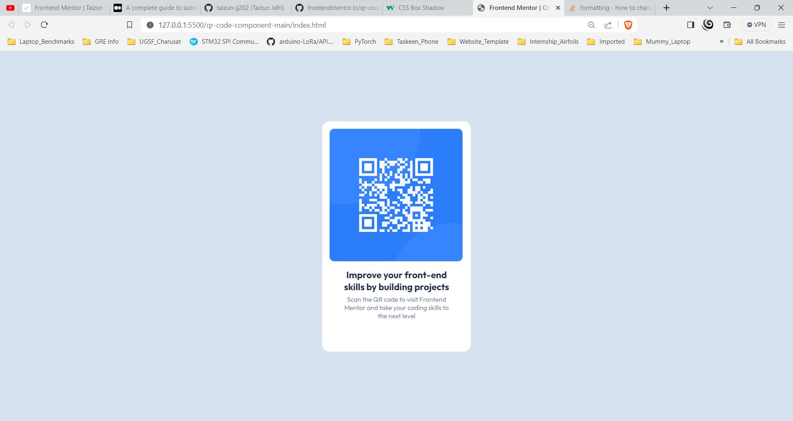
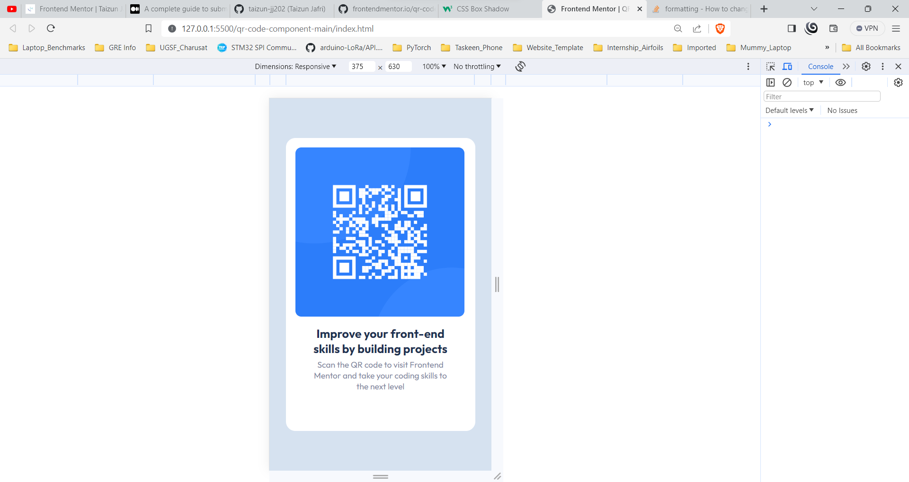

# Frontend Mentor - QR code component solution

This is a solution to the [QR code component challenge on Frontend Mentor](https://www.frontendmentor.io/challenges/qr-code-component-iux_sIO_H). 

## Table of Contents

- [Overview](#Overview)
  - [Screenshots](#screenshots)
- [My Process](#my-process)
  - [Built with :](#built-with)
  - [What I learned](#what-i-learned)
- [Author](#author)

## Overview

### Screenshots

- This is the desktop view. 
  - Resolution => 1920 x 897
  - Browser    => Brave 

- The mobile view 
  - Resolution => 375 x 630
  - Browser    => Brave 

## My Process

### Built with : 

 - HTML5 
 - CSS custom properties
 - Object-fit

 ### What I learned

 The main problem was centering and fitting the QR Code image into its `div` tag. Solved that problem using `object-fit` method.
 
 Each paragraph is in its own `div` tag.

 ## Author

- GitHub - [Taizun Jafri](https://github.com/taizun-jj202)
- Frontend Mentor - [@taizun-jj202](https://www.frontendmentor.io/profile/taizun-jj202)
- Twitter - [@JafriTaizun](https://www.twitter.com/JafriTaizun)

